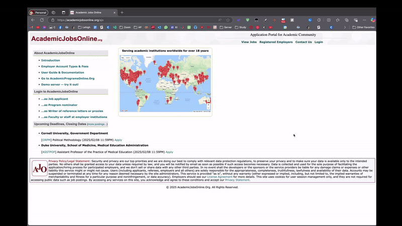

# AcademicJobScraper

A Python package for scraping and filtering academic job listings from academicjobsonline.org.

## Getting Started

Before using the package, you'll need to get the job listing URLs from academicjobsonline.org. Here's how to filter and grab the links you want to process:



## Installation

```bash
pip install academicjobscraper
```

## Usage

### As a Python Module

```python
from academicjobscraper import AcademicJobScraper

# Initialize the scraper with required keywords and optional file names
scraper = AcademicJobScraper(
    keywords=["machine learning", "deep learning", "AI"],  # Required
    links_file="job_links.csv",      # Optional (default: job_links.csv)
    data_file="jobs_data.json",      # Optional (default: jobs_data.json)
    results_file="relevant_jobs.csv"  # Optional (default: relevant_jobs.csv)
)

# Start scraping with a mother link
scraper.scrape("https://academicjobsonline.org/your-search-url")
```

### Command Line Interface

```bash
# Basic usage with required parameters
academicjobscraper "https://academicjobsonline.org/your-search-url" "machine learning" "deep learning" "AI"

# With optional file name parameters
academicjobscraper "https://academicjobsonline.org/your-search-url" \
    "machine learning" "deep learning" "AI" \
    --links-file custom_links.csv \
    --data-file custom_data.json \
    --results-file custom_results.csv
```

## Features

- Scrapes job listings from academicjobsonline.org
- Extracts detailed job information
- Filters jobs based on provided keywords
- Customizable output file names
- Progress tracking during scraping

## Output Files

The scraper generates three files:

1. `job_links.csv` - Contains all scraped job URLs
2. `jobs_data.json` - Contains detailed information for all jobs
3. `relevant_jobs.csv` - Contains filtered jobs matching the keywords

## License

This project is licensed under the MIT License - see the LICENSE file for details.
